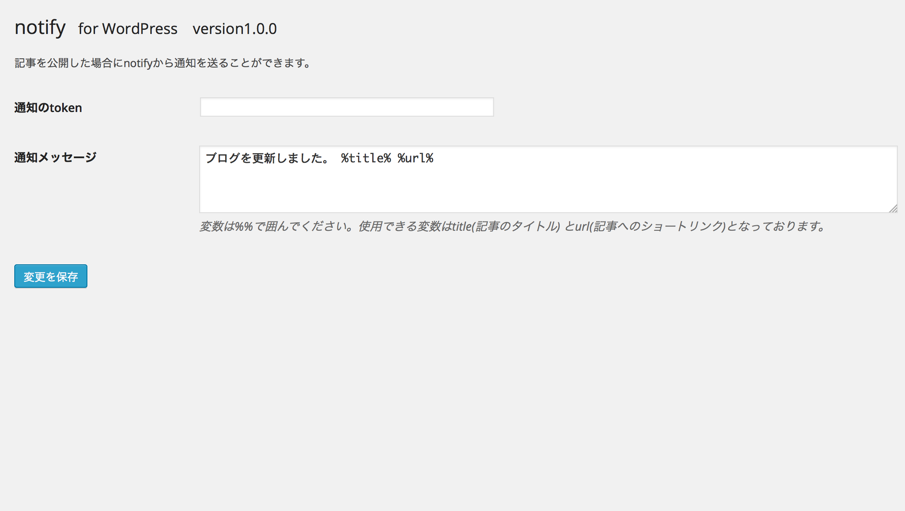

#notify <small>for WordPress</small>

# FEATURES
This plugin sends notifications when

 1. a new post/page/custom post type published

# SCREENSHOTS

# Installation
1. Create a new notify account on [here](https://ntfy.jp/sender/sign_in "New notify account")
2. Create a new notification and get **token**
3. Activate the plugin through the 'Plugins' menu in WordPress
4. Add **token** and **message** on *Settings > notify* page. Click **SAVE** button.

# More description
* [https://ntfy.jp/api/documents/wordpress](https://ntfy.jp/api/documents/wordpress)

# AUTHOR
* [Shunsuke Hayashi](http://kokonotsu.net)

